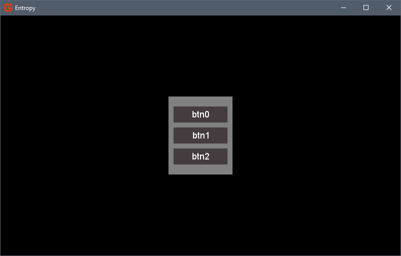

## Getting Started With Entropy.UI

~~~csharp
    public class MenuContext : UIContext
    {
        LinearLayout layout0 = new LinearLayout(){
            Margin = 10,
            Padding = "10,20,10,20",
            Spacing = 10,
            Orientation = Orientation.Vertical,
            Anchor = Alignment.VCenter | Alignment.HCenter,
            Background = Drawable.Gray
        };
        
        Button button0 = new Button() { Content = "btn0" };
        Button button1 = new Button() { Content = "btn1" };
        Button button2 = new Button() { Content = "btn2" };
        
        layout0.Add(button0, button1, button2)
        
        AddView(layout0);
    }
~~~

Xml Representation

~~~xml
    <!--Object Tree-->
    <LinearLayout Padding="10,20,10,20" Anchor="VCenter,HCenter" Orientation="Vertical" Margin="10" Spacing="10", Background="#808080">
        <Button Content="btn0"/>
        <Button Content="btn1"/>
        <Button Content="btn2"/>
    </LinearLayout>
~~~
